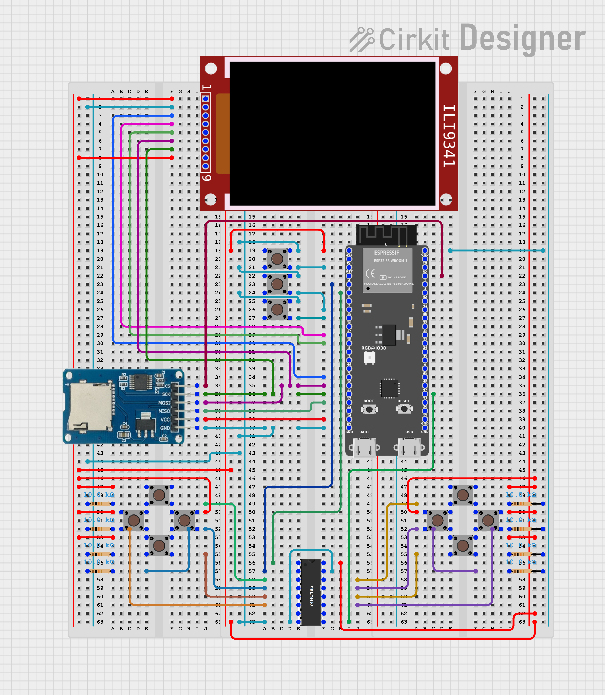

# IONES Firmware
Firmware of the ESP-32 based handheld console IONES.

**Recommended IDF Version:** 5.5.4

**Recommended VSCode Extension Version:** 1.11.1 -- *(2.1.0 is half-baked as hell)*

## Build Instructions

#### To compile, run:
`$ idf.py build`

#### To flash, run:
`$ idf.py flash`

#### To see the console monitor, run:
`$ idf.py build`

#### To do all above at once, run:
`$ idf.py build flash run`

